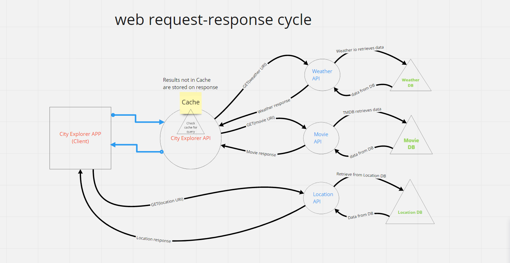

**Author**: Edris Berg
**Version**: 1.0.10 

## Overview
Users can search for a specific city. City information, latitude, longitude and along with a map will be displayed. The user then can retrieve weather and movies related to that city. 
[link](https://explore-cities.netlify.app/)

## Getting Started
The app is built with React, node and axios. Installing these tools required.
Provide your own API access keys to use the APIs and add .env file and add the API keys into it.

## Architecture

The app uses:
 -  `React`,
 -  `node.js`,
 -  `React Bootstrap`
 -  `axios` 
## project progressive diagrams

## final data flow diagram

## Credit and Collaborations

## Change Log

11-02-2021 5:14 application is fully functional and returns search results, maps and weather inforamtion.

11-04-2021 12:00pm in addition to the above, the app now retrieves movie data.
11-05-2021 7:00pm caches current results for faster access.

Name of feature: Setting up the app/repo
 - Estimate of time needed to complete: 2hrs
- Start time: 3:00 PM
- Finish time: 5:00PM
- Actual time needed to complete: 1.3hrs
  
Name of feature: Locations 
- Estimate of time needed to complete: 2hrs
- Start time: 5:00 PM
- 	Finish time: 6:30 PM
- 	Actual time needed to complete: 1.5hrs

Name of feature: Map display
- Estimate of time needed to complete: 3 hour
- Start time: 2:00 PM
- Finish time: 4:30 PM
- Actual time needed to complete: 2.5hrs

Name of feature: Errors:
- Estimate of time needed to complete: 30 minutes	
- Start time: 4:30 PM
- Finish time: 5:30 PM
- Actual time needed to complete: 1hr 

11-02-2021 5:14
Name of feature: weather:
- Estimate of time needed to complete: 1hr	
- Start time: 1:00 PM
- Finish time: 3:00 PM
- Actual time needed to complete: 2hrs 

Name of feature: Back-end API:
- Estimate of time needed to complete: 1.5hrs	
- Start time: 3:00 PM
- Finish time: 5:00 PM
- Actual time needed to complete: 2hrs 

  
Name of feature: Retrieving Movie data 
- Estimate of time needed to complete: 4 hrs	
- Start time: 9:00 PM
- Finish time:12:00 Am
- Actual time needed to complete: 3hrs

Name of feature: Refactoring/Modularizing the back-end codebase.
- Estimate of time needed to complete: 5 hrs	
- Start time: 7:00 PM
- Finish time:12:00 PM
- Actual time needed to complete: 4hrs

Application now fully functional with express server and deployed in Netlify and Heroku. Recent searched results are stored in cache.

<!-- Use this area to document the iterative changes made to your application as each feature is successfully implemented. Use time stamps. Here's an example:

01-01-2001 4:59pm - Application now has a fully-functional express server, with a GET route for the location resource. -->

## Credit and Collaborations
 For WRRC diagrams Collaborated with:

  [ K'Lan Stovall](https://github.com/KSTOV).

[Jordan Folk](https://github.com/folksmash) 

[Ryan Hoffman](https://github.com/ryanhoffman4)

[Joe Streifel](https://github.com/jstreifel-33)

[Rushabh Soni]()

<!-- Give credit (and a link) to other people or resources that helped you build this application. -->